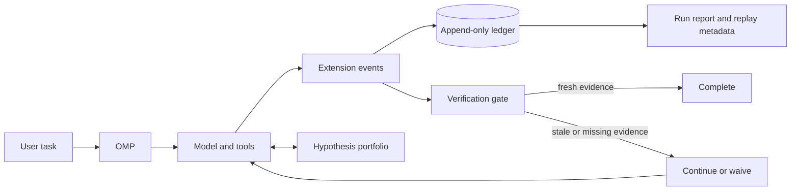

# omp-supercharged

**Evidence, verification, and adaptive control for [Oh My Pi][omp]—without forking it.**

`omp-supercharged` is a portable, Git-versioned extension layer for OMP. It is designed to make agent runs more inspectable, bounded, and trustworthy by turning strong harness-engineering ideas into reusable tools, policies, and run artifacts.

> [!IMPORTANT]
> **Project status: pre-alpha.** This repository currently defines the product, architecture, and intended public interface. The installable extension package is under development; follow the roadmap before relying on it in production.

## Why this exists

OMP already provides a strong agent substrate: structured tools, hash-anchored edits, LSP integration, executable Python and JavaScript, subagents, isolation modes, retries, and persistent sessions. `omp-supercharged` focuses on the control plane around those capabilities:

- make state and evidence durable instead of relying on one model context;
- require fresh verification after successful mutations;
- represent uncertainty explicitly when multiple explanations remain plausible;
- spend subagent calls and runtime within deliberate budgets;
- leave behind a run record that can be inspected without trusting the final prose summary.

The goal is not a longer system prompt or a permanent swarm. It is a small set of runtime guarantees that make OMP easier to trust on consequential work.

## What it adds

The first release is designed around five capabilities.

| Capability | What it does | Why it matters |
|---|---|---|
| **Append-only run ledger** | Records versioned session, tool, retry, mutation, verification, and stop events with hashes and artifact references. | A result can be inspected and reconstructed after the model context is gone. |
| **Verification freshness gate** | Tracks successful mutations and requires newer verification evidence—or an explicit, recorded waiver—before completion. | “Done” becomes an observable state transition, not a sentence. |
| **Hypothesis portfolio** | Stores competing mechanisms, supporting and opposing evidence, predictions, falsification tests, confidence, and status. | Ambiguous work branches on evidence rather than rhetoric or majority vote. |
| **Bounded execution policy** | Supplies conservative OMP settings for concurrency, request budgets, runtime, approval, and workspace isolation. | Expensive or risky loops stop at explicit limits. |
| **Run reports** | Exports model, prompt, tool, artifact, verification, budget, and stop metadata in a stable manifest. | Performance and failures can be compared across runs instead of remembered anecdotally. |

## How it works



OMP remains responsible for models, tools, sessions, and updates. `omp-supercharged` uses OMP's documented extension surface to register event handlers, typed tools, slash commands, and policies.[^omp-extensions]

The extension source lives in this repository. Runtime state does not:

```text
~/.local/state/omp-supercharged/
  runs/<run-id>/events.jsonl
  runs/<run-id>/manifest.json

~/.local/share/omp-supercharged/
  artifacts/sha256/<content-hash>
```

This separation keeps the source repository clean and makes run data independently removable.

## Installation

### Prerequisite

Install a current version of [Oh My Pi][omp] using its official installation instructions, then confirm that the CLI is available:

```bash
omp --version
```

### Install from source

> [!NOTE]
> These commands become usable when the first extension package lands. During pre-alpha, the repository contains the product specification and roadmap only.

Clone this repository into any stable directory, enter it, and link it into OMP:

```bash
cd /absolute/path/to/omp-supercharged
omp plugin link "$PWD"
omp plugin doctor
```

`plugin link` creates a user-level link to the working tree. The repository remains the source of truth, so pulling a new revision updates the linked extension without copying files into OMP's installation directory.

### Try it without a persistent link

An explicit extension path keeps the enhanced runtime opt-in:

```bash
export OMP_SUPERCHARGED_HOME=/absolute/path/to/omp-supercharged
omp --extension "$OMP_SUPERCHARGED_HOME"
```

Load the versioned hardening overlay for the same process:

```bash
omp \
  --extension "$OMP_SUPERCHARGED_HOME" \
  --config "$OMP_SUPERCHARGED_HOME/config/hardened.yml"
```

Normal `omp` remains available as an unmodified fallback, and `omp update` continues to operate on the stock OMP installation.

## Usage

After a persistent link, start OMP normally from the project you want to work on:

```bash
cd /path/to/your-project
omp
```

The intended default workflow is automatic:

1. The run ledger opens when the session starts.
2. Successful write operations advance the mutation epoch.
3. Successful checks record verification evidence against that epoch.
4. If the session attempts to stop with newer unverified mutations, the gate requests one bounded verification pass.
5. Completion records the evidence, budget outcome, and stop reason in the run manifest.

The planned interactive commands are:

| Command | Purpose |
|---|---|
| `/harness-status` | Show the current mutation, verification, hypothesis, and budget state. |
| `/harness-export` | Write a stable run manifest and display its path. |
| `/harness-waive <reason>` | Explicitly waive unavailable verification and preserve the reason in the ledger. |

The model-facing hypothesis tool is intended for genuinely ambiguous work, not every task. A typical request can stay natural:

> Track the competing root-cause hypotheses, identify the cheapest falsification test, then proceed with the best-supported explanation.

## Why it helps

### Evidence survives the context window

Model context is working memory, not an audit log. An append-only ledger preserves exact lineage while derived manifests and indexes remain rebuildable views.

### Verification becomes a runtime invariant

Prompts can ask an agent to test its work, but prompts do not enforce state transitions. The freshness gate checks whether verification happened after the latest successful mutation and prevents accidental “verified before the final edit” completions.

### Parallelism becomes selective

More agents are not automatically better. `omp-supercharged` is designed to keep straightforward work single-threaded and reserve independent candidates or critics for high-impact uncertainty.

### Failure becomes inspectable

A run report distinguishes provider errors, tool failures, verification failures, policy blocks, explicit waivers, and budget stops. That makes failures actionable and enables comparisons across models, prompts, and policies.

### OMP remains updateable

This project does not patch OMP source, overwrite bundled prompts, or replace the `omp` executable. It loads through the extension interface and keeps its configuration in a separate repository. OMP API changes may still require a compatibility release, but there is no fork to merge during routine updates.

## The tweet that started it

The spark was [Alex Fazio's post about harness engineering][fazio-tweet]. He argued that ARC-AGI harnesses are unusually useful artifacts because they expose what works from first principles, what is empty ceremony, and what may be overfitted to a benchmark.

That observation led to the question behind this repository:

> What would it look like to extract the transferable control-plane ideas from strong ARC harnesses and make them available for everyday coding, research, and automation in OMP?

`omp-supercharged` is the answer in extension form. It does not attempt to turn OMP into an ARC solver. It ports the general mechanisms: externalized state, executable computation, selective branching, typed boundaries, closed-loop verification, budgets, and replayable evidence.

## Projects that inspired the design

### ARCgentica: executable candidates and sparse recursive decomposition

[ARCgentica][arcgentica] targets the static ARC-AGI-2 regime. Its published harness runs independent attempts, lets a root agent delegate recursively when useful, synthesizes Python transformations, executes them against examples, and persists configuration, candidate programs, usage, timing, results, and per-agent logs.[^arcgentica-readme][^arcgentica-agent][^arcgentica-solve]

The transferable lesson is not “spawn ten agents.” The stronger pattern is:

- let one root reasoner handle straightforward cases;
- branch when decomposition, ambiguity, or adversarial review justifies the cost;
- turn a hypothesis into an executable artifact;
- let deterministic execution—not persuasive prose—decide whether the artifact survives;
- preserve the trace needed to understand the result.

`omp-supercharged` translates that into selective hypothesis branching, typed session state, verifier freshness, and durable run manifests.

### RGB-Agent: the log is memory, and plans are short

[RGB-Agent][rgb-agent] targets the interactive ARC-AGI-3 regime. Its analyzer reads a durable game log with Read, Grep, and Python, emits a JSON action plan, and lets an action queue execute steps without another model call. The analyzer runs again when the queue empties or the score changes.[^rgb-readme][^rgb-runner][^rgb-queue]

The transferable lessons are:

- keep raw observations and actions outside the prompt;
- retrieve and compute over the relevant evidence programmatically;
- separate planning from execution with a typed boundary;
- use short, receding-horizon plans;
- replan when observed state diverges from expectations;
- keep the execution environment narrower than the model's reasoning environment.

`omp-supercharged` applies these ideas to code changes and tool use: append-only evidence, explicit plan state, bounded execution, and verification after observed mutations.

### Recursive Language Models: context as an external environment

The [Recursive Language Models paper][rlm] formalizes a related principle: treat long context as an external environment that the model can inspect programmatically, decompose, and recurse over selectively rather than forcing everything into one prompt.[^rlm]

That informs the repository's memory model: canonical events and artifacts first; summaries, indexes, and selected context second.

### A necessary benchmark caveat

ARCgentica and RGB-Agent address different benchmark regimes: [ARC-AGI-2][arc-agi-2] is static program induction, while [ARC-AGI-3][arc-agi-3] is interactive environment control. They are not directly comparable, and benchmark-specific tactics should not be copied blindly.

This project takes inspiration from the mechanisms that transfer across domains, not from ARC-specific grid representations, prompts, scoring rules, or action spaces.

## Design principles

1. **Evidence is canonical.** Summaries and indexes are derived, attributable, and rebuildable.
2. **The model proposes; the harness verifies.** Acceptance belongs to deterministic checks wherever possible.
3. **Mutation invalidates prior verification.** Evidence must be fresh relative to the state it supports.
4. **Uncertainty earns compute.** Branch only when alternatives make materially different predictions.
5. **Plans are data, not prose.** Missing or invalid fields reject the plan instead of inventing defaults.
6. **Every loop has a budget.** Tokens, requests, time, actions, depth, and concurrency need finite limits.
7. **Raw capability is not isolation.** Workspace separation, process containment, network policy, and secret handling are different controls.
8. **OMP stays stock.** Extend public surfaces; do not carry a private fork.

## Non-goals

`omp-supercharged` is not:

- a replacement for OMP;
- a universal system prompt;
- an always-on multi-agent organization;
- a vector database disguised as memory;
- a claim that verification can prove arbitrary software correct;
- a security sandbox merely because it can intercept tool calls;
- an ARC benchmark submission.

## Security and privacy

OMP extensions execute as trusted code inside the OMP process. Install only revisions you trust.

The planned defaults are intentionally conservative:

- metadata and hashes are recorded by default, not unrestricted raw secrets;
- runtime artifacts live outside the Git repository;
- failed or malformed plans do not partially execute;
- waivers are explicit and attributable;
- generated or hostile code requires a separate container-backed executor before it can be described as sandboxed;
- OMP workspace isolation is treated as edit isolation, not as a complete security boundary.

## Roadmap

- [ ] Package manifest and minimal extension entry point
- [ ] Versioned append-only event ledger
- [ ] Mutation and verification freshness tracking
- [ ] `/harness-status`, `/harness-export`, and `/harness-waive`
- [ ] Typed hypothesis portfolio tool
- [ ] Conservative `config/hardened.yml` overlay
- [ ] Content-addressed artifact storage and run manifests
- [ ] Focused compatibility and failure-recovery tests
- [ ] Optional container-backed executor for untrusted candidate code
- [ ] Paired evaluations against unextended OMP workflows

The project will not add a memory database, role hierarchy, or elaborate planner until traces demonstrate a concrete need.

## Sources and attribution

| Source | Contribution to this project |
|---|---|
| [Alex Fazio's harness-engineering post][fazio-tweet] | The prompt to study strong ARC harnesses for first-principles, transferable design. |
| [Oh My Pi][omp] and its [extension architecture][omp-extensions] | The host runtime and update-safe extension surface. |
| [ARCgentica, pinned revision][arcgentica] | Independent attempts, recursive decomposition, executable transformations, verification, and complete run artifacts. |
| [RGB-Agent, pinned revision][rgb-agent] | Durable logs, programmatic perception, short action batches, event-driven replanning, and constrained execution. |
| [Recursive Language Models][rlm] | The external-context and recursive-selection model. |
| [ARC-AGI-2][arc-agi-2] and [ARC-AGI-3][arc-agi-3] | The benchmark regimes needed to interpret the source harnesses accurately. |

## License

Licensed under the [Apache License 2.0](LICENSE).

[fazio-tweet]: https://x.com/alxfazio/status/2073091833530392614
[omp]: https://github.com/can1357/oh-my-pi
[omp-extensions]: https://github.com/can1357/oh-my-pi/blob/main/docs/extensions.md
[arcgentica]: https://github.com/symbolica-ai/arcgentica/tree/bbba64d047e7e043619e50e336dd75c60f234d00
[arcgentica-readme]: https://github.com/symbolica-ai/arcgentica/blob/bbba64d047e7e043619e50e336dd75c60f234d00/README.md
[arcgentica-agent]: https://github.com/symbolica-ai/arcgentica/blob/bbba64d047e7e043619e50e336dd75c60f234d00/arc_agent/agent.py
[arcgentica-solve]: https://github.com/symbolica-ai/arcgentica/blob/bbba64d047e7e043619e50e336dd75c60f234d00/solve.py
[rgb-agent]: https://github.com/alexisfox7/RGB-Agent/tree/c0a685cfd7152418195df8cd014bdc3a8ec3a4d4
[rgb-readme]: https://github.com/alexisfox7/RGB-Agent/blob/c0a685cfd7152418195df8cd014bdc3a8ec3a4d4/README.md
[rgb-runner]: https://github.com/alexisfox7/RGB-Agent/blob/c0a685cfd7152418195df8cd014bdc3a8ec3a4d4/rgb_agent/environment/runner.py
[rgb-queue]: https://github.com/alexisfox7/RGB-Agent/blob/c0a685cfd7152418195df8cd014bdc3a8ec3a4d4/rgb_agent/agent/action_queue.py
[rlm]: https://arxiv.org/abs/2512.24601
[arc-agi-2]: https://github.com/arcprize/ARC-AGI-2
[arc-agi-3]: https://arcprize.org/arc-agi/3

[^omp-extensions]: OMP's extension guide documents event handlers, typed tools, slash commands, and runtime hooks through `ExtensionAPI`.
[^arcgentica-readme]: ARCgentica documents two independent attempts, recursive subagents, executable Python transformations, and published run artifacts in its [README][arcgentica-readme].
[^arcgentica-agent]: The pinned [`arc_agent/agent.py`][arcgentica-agent] implements the root REPL and recursive agent capability.
[^arcgentica-solve]: The pinned [`solve.py`][arcgentica-solve] executes candidate transformation code and evaluates it against task examples.
[^rgb-readme]: RGB-Agent summarizes its Read/Grep/Python analyzer, JSON plan, action queue, and container architecture in its [README][rgb-readme].
[^rgb-runner]: The pinned [`environment/runner.py`][rgb-runner] implements the online observe, analyze, queue, act, and log loop.
[^rgb-queue]: The pinned [`agent/action_queue.py`][rgb-queue] implements batched action execution and queue invalidation behavior.
[^rlm]: Zhang, Kraska, and Khattab describe prompts as external environments that models inspect, decompose, and recursively process in [Recursive Language Models][rlm].
