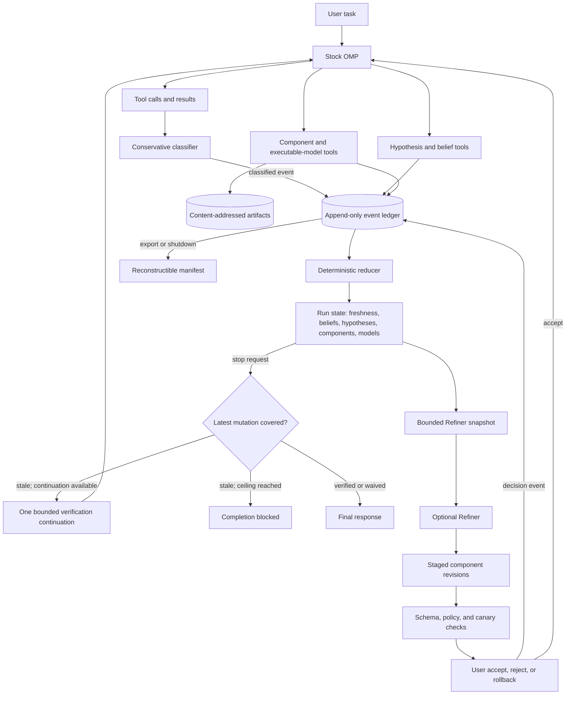

# omp-supercharged

> if you’re into harness engineering, i strongly recommend looking into arc agi winning harnesses. they clearly illustrate what works from first principles, what is bs, and why a lot of current harness design is overfitted to benchmarkmaxx
>
> — [Alex Fazio][fazio-tweet]

ARC-AGI is the toughest public test of general reasoning in the world right now. Across [ARC-AGI-2][arc-agi-2] and [ARC-AGI-3][arc-agi-3], a model faces unfamiliar tasks, strict interfaces, and exact scoring. A harness cannot bluff its way through that.

`omp-supercharged` is built from the best ideas found in those harnesses. Grid solvers and game prompts stay behind. The transferred discipline preserves the trajectory, discards stale evidence, tests competing explanations, and requires every harness change to earn its way into the live system.

Give OMP a task and it can already move fast. `omp-supercharged` makes “done” harder to fake. Every run leaves a versioned ledger, every successful mutation recorded by the harness expires old verification, and every small state model can be checked against exact observations. Stock OMP gets ARC-grade harness discipline without replacing its agent substrate.

## Install

Install a current [OMP][omp] release, clone this repository to a stable path, then let OMP handle the plugin:

```bash
omp --version
cd /absolute/path/to/omp-supercharged
omp plugin install "$PWD"
omp plugin doctor
```

A local install is a source link. Pull the repository and the installed plugin updates with it. `omp plugin link "$PWD"` does the same thing.

Check that OMP sees it:

```bash
omp plugin list
```

Start OMP from any project as usual:

```bash
cd /path/to/project
omp
```

For a one-off run, skip the install:

```bash
omp --extension /absolute/path/to/omp-supercharged
```

## The tools

| Tool                   | What it does                                                                       |
| ---------------------- | ---------------------------------------------------------------------------------- |
| `hypothesis_portfolio` | Keeps competing explanations, evidence, predictions, and falsification tests.      |
| `belief_state`         | Carries useful claims, plans, and open questions across turns with their evidence. |
| `harness_component`    | Stages versioned changes to policies, skills, read-only agents, and memory.        |
| `executable_model`     | Builds small state graphs and checks them through simulation and exact replay.     |

The checked-in default policy enables all four tools. Its relevant settings are below.

```json
{
  "evaluation": {
    "condition": "executable_model"
  },
  "refiner": {
    "enabled": true,
    "autoActivate": false,
    "triggers": []
  }
}
```

`executable_model` includes the lower feature levels, so the ledger, belief state, adaptive components, and state models are active together. By default, the Refiner runs only through explicit `/harness-refine` calls. Automatic triggers and `autoActivate` remain off, preventing unrequested model spend or live harness changes.

### Change the project policy

Use `.omp/supercharged.json` in the current project to narrow features or configure automatic Refiner runs. This example enables three triggers while keeping activation user-controlled:

```json
{
  "version": 1,
  "evaluation": {
    "condition": "executable_model"
  },
  "refiner": {
    "enabled": true,
    "autoActivate": false,
    "triggers": [
      "verification_failure",
      "repeated_tool_failure",
      "belief_contradiction"
    ],
    "maxRuns": 2
  }
}
```

Each level includes the one before it.

| Condition          | What is active                                              |
| ------------------ | ----------------------------------------------------------- |
| `ledger`           | Ledger, freshness gate, manifests, and hypotheses           |
| `state`            | Everything in `ledger`, plus beliefs                        |
| `refiner`          | Everything in `state`, plus adaptive components             |
| `executable_model` | Everything in `refiner`, plus state models. This is default |

A malformed policy is rejected as a whole and shows up in `/harness-status`.

## Commands

| Command                                              | Action                                                    |
| ---------------------------------------------------- | --------------------------------------------------------- |
| `/harness-status`                                    | Show verification, state, components, models, and policy. |
| `/harness-export`                                    | Rebuild and write the run manifest.                       |
| `/harness-waive <reason>`                            | Waive verification for the current mutation epoch.        |
| `/harness-refine [reason]`                           | Run one bounded Refiner pass.                             |
| `/harness-components`                                | List component revisions.                                 |
| `/harness-component-accept <revision-id>`            | Activate a canary-valid revision.                         |
| `/harness-component-reject <revision-id> <reason>`   | Reject a staged revision.                                 |
| `/harness-component-rollback <revision-id> <reason>` | Roll back an active revision.                             |

## What happens during a run

The extension opens a ledger when the session starts. A successful mutation advances the mutation epoch, and any earlier test result stops counting. Verification has to happen after that mutation.

If the agent tries to stop while the run is stale, it gets one bounded continuation to check the work. Shutdown writes a manifest that can be rebuilt from the ledger.

### Data flow



The files live outside the repository:

```text
~/.local/state/omp-supercharged/runs/<run-id>/events.jsonl
~/.local/state/omp-supercharged/runs/<run-id>/manifest.json
~/.local/share/omp-supercharged/artifacts/sha256/<content-hash>
```

By default, the ledger stores metadata and hashes rather than raw prompts, environment values, or tool bodies.

## Tighten the runtime

The bundled hardening overlay adds write approval, a 900-second tool timeout, four concurrent subagents, recursion depth two, a 30-request soft budget, a 20-minute task limit, and automatic workspace isolation.

```bash
omp --config /absolute/path/to/omp-supercharged/config/hardened.yml
```

## Tested against stock OMP

The `0.1.0` release gate gave stock and enhanced OMP the same tasks and immutable verifiers. Two 20-cell runs produced 38/40 passes, including one 20/20 run. The only misses were two 300-second weak-model timeouts. Provider and harness failures were both zero. Every enhanced condition matched or beat stock task success.

The current extension is tested with OMP `17.0.5`.

Run the checks:

```bash
sfw-npm test
sfw-npm run evaluate -- evaluation/suites/release-gate.json
```

Each evaluation cell gets a fresh workspace and a verifier the agent cannot edit. Interrupted cells can resume, and provider outages are kept separate from task failures. The implementation and release details are in [`docs/CURRENTPLAN.md`](docs/CURRENTPLAN.md).

After an OMP update, run:

```bash
omp plugin doctor
```

## Boundaries

This plugin runs inside OMP, so only trusted code should be installed. Workspace isolation keeps edits separate. It does not cut network access or hide credentials and secrets.

- The completion gate catches stale verification. It cannot prove arbitrary software correct.
- Executable models are declarative state graphs. They do not run generated simulator code.
- Component revisions do not activate themselves by default.
- Hostile or generated code still belongs in a separate container-backed executor.

Unknown shell commands stay unclassified instead of being guessed into the mutation record. Consequential work still needs a real external check.

## What `omp-supercharged` takes from the ARC harnesses

Grid solvers, game APIs, and ARC scoring are excluded from the transfer. The surviving mechanisms are added one layer at a time. The evaluator can run stock OMP and the cumulative `ledger`, `state`, `refiner`, and `executable_model` conditions on the same coding task.

| Source                                                                                        | What transferred                                                                                                                                                                                                                                                                                                                                   |
| --------------------------------------------------------------------------------------------- | -------------------------------------------------------------------------------------------------------------------------------------------------------------------------------------------------------------------------------------------------------------------------------------------------------------------------------------------------- |
| [ARCgentica][arcgentica]                                                                      | Independent candidate solutions, deterministic checks against examples, and complete run artifacts became competing hypotheses tied to evidence plus reconstructible ledgers and manifests. Stock OMP already handles recursion, so no additional recursive agent loop was added.                                                                  |
| [RGB-Agent][rgb-agent]                                                                        | Its append-only external state became the JSONL ledger and reducers. Its evidence-first workflow shows up in beliefs and hypotheses that carry references. Its queue invalidation rule became the same discipline behind the freshness gate: change the work and old verification stops counting.                                                  |
| [Duck Harness][duck-harness]                                                                  | Duck showed how far a small, bounded shell around a capable model can go. OMP stays the agent substrate here; the plugin supplies the control layer. The optional overlay caps requests, recursion, runtime, and concurrency, while the evaluator reports model calls, actions, elapsed time, and storage.                                         |
| [Executable World Models][executable-world-models] and its [baseline][ewm-baseline]           | Fixed interfaces for reconstruction, simulation, planning, simplification, and replay became the `executable_model` tool. Models are declarative, content-hashed, and checked against exact observations. Evaluation cells use fresh workspaces and protected verifiers. Generated simulator code remains out of scope.                            |
| [Continual Harness][continual-harness-paper] and its [implementation][continual-harness-repo] | Trajectory-driven improvements to prompts, agents, skills, and memory became the Refiner. It reads a bounded run snapshot and stages versioned policy, skill, read-only agent, or memory revisions. Schema, policy, and canary checks come before user acceptance; rejection and rollback are built in. Automatic activation stays off by default. |
| [Recursive Language Models][rlm]                                                              | Long context becomes something to inspect, not a blob to stuff into one prompt. Ledgers, artifacts, beliefs, and hypotheses therefore live outside the model context, and the Refiner receives a bounded reconstruction. RLM informs the context design; it does not add a hidden RLM runtime.                                                     |
| [ARC-AGI-2][arc-agi-2] and [ARC-AGI-3][arc-agi-3]                                             | Their evaluation discipline became the release gate. The same task, model, workspace fixture, and immutable verifier run through every condition, with provider, harness, and task failures counted separately.                                                                                                                                    |

ARC winners are optimized for a benchmark, so transfer was the filter. ARC exposed the mechanics under pressure; coding tasks decided what stayed.

## License

[Apache License 2.0](LICENSE)

## Sources

- [Alex Fazio's harness-engineering tweet][fazio-tweet]
- [Oh My Pi][omp] and its [extension API][omp-extensions]
- [ARCgentica][arcgentica]
- [RGB-Agent][rgb-agent]
- [Duck Harness][duck-harness]
- [Executable World Models][executable-world-models] and its [baseline implementation][ewm-baseline]
- [Continual Harness][continual-harness-paper], its [project site][continual-harness-site], and its [ARC-AGI-3 implementation][continual-harness-repo]
- [Recursive Language Models][rlm]
- [ARC-AGI-2][arc-agi-2] and [ARC-AGI-3][arc-agi-3]

[omp]: https://github.com/can1357/oh-my-pi
[fazio-tweet]: https://x.com/alxfazio/status/2073091833530392614
[omp-extensions]: https://github.com/can1357/oh-my-pi/blob/main/docs/extensions.md
[arcgentica]: https://github.com/symbolica-ai/arcgentica/tree/bbba64d047e7e043619e50e336dd75c60f234d00
[rgb-agent]: https://github.com/alexisfox7/RGB-Agent/tree/c0a685cfd7152418195df8cd014bdc3a8ec3a4d4
[duck-harness]: https://tufalabs.ai/research/duck-harness/
[executable-world-models]: https://arxiv.org/abs/2605.05138
[ewm-baseline]: https://github.com/astroseger/arc-3-agents-baseline1
[continual-harness-paper]: https://arxiv.org/abs/2605.09998
[continual-harness-site]: https://continual-harness.github.io/
[continual-harness-repo]: https://github.com/feng-rrRay/Continual-Harness-ARC-AGI-3
[rlm]: https://arxiv.org/abs/2512.24601
[arc-agi-2]: https://github.com/arcprize/ARC-AGI-2
[arc-agi-3]: https://arcprize.org/arc-agi/3
