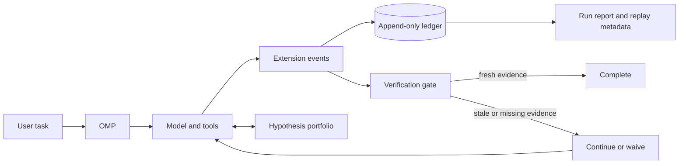

# omp-supercharged

**Evidence, verification, and adaptive control for [Oh My Pi][omp]—without forking it.**

`omp-supercharged` is a portable, Git-versioned extension layer for OMP. It is designed to make agent runs more inspectable, bounded, and trustworthy by turning strong harness-engineering ideas into reusable tools, policies, and run artifacts.

> [!IMPORTANT]
> **Project status: `0.1.0` pre-alpha.** The source-linkable extension, runtime ledger, freshness gate, typed state tools, adaptive component controls, and focused tests are implemented and smoke-tested with OMP `17.0.5`. The adaptive layers remain opt-in, and this is not yet a production security boundary.

## Why this exists

OMP already provides a strong agent substrate: structured tools, hash-anchored edits, LSP integration, executable Python and JavaScript, subagents, isolation modes, retries, and persistent sessions. `omp-supercharged` focuses on the control plane around those capabilities:

- make state and evidence durable instead of relying on one model context;
- require fresh verification after successful mutations;
- represent uncertainty explicitly when multiple explanations remain plausible;
- spend subagent calls and runtime within deliberate budgets;
- leave behind a run record that can be inspected without trusting the final prose summary.

The goal is not a longer system prompt or a permanent swarm. It is a small set of runtime guarantees that make OMP easier to trust on consequential work.

## What it adds

The default runtime and its opt-in adaptive layers provide these capabilities:

| Capability                        | What it does                                                                                                                     | Why it matters                                                                                                            |
| --------------------------------- | -------------------------------------------------------------------------------------------------------------------------------- | ------------------------------------------------------------------------------------------------------------------------- |
| **Append-only run ledger**        | Records versioned session, tool, retry, mutation, verification, lineage, component, and stop events with hashes.                 | A result can be inspected and reconstructed after the model context is gone.                                              |
| **Verification freshness gate**   | Tracks successful mutations and requires newer verification evidence—or an explicit, recorded waiver—before completion.          | “Done” becomes an observable state transition, not a sentence.                                                            |
| **Hypothesis portfolio**          | Stores competing mechanisms, evidence, predictions, falsification tests, confidence, and status.                                 | Ambiguous work branches on evidence rather than rhetoric or majority vote.                                                |
| **Evidence-linked belief state**  | Maintains compact world, goal, action, finding, question, plan, and cross-task claims with confidence and evidence references.   | Working state stays attributable instead of becoming an ungrounded summary.                                               |
| **Staged adaptive components**    | Validates, content-addresses, canaries, activates, rejects, and rolls back policy, skill, read-only agent, and memory revisions. | A model may propose improvements, but deterministic checks and user-only controls decide adoption.                        |
| **Bounded Refiner**               | Optionally analyzes evidence-linked trajectories after configured triggers and proposes component revisions.                     | Adaptation uses explicit budgets, trigger provenance, and rollback metrics rather than rewriting the live prompt blindly. |
| **Declarative executable models** | Reconstructs, predicts, replays, simplifies, and verifies bounded state graphs without executing generated code.                 | Deterministic domains can reject theories that fail exact replay.                                                         |
| **Bounded execution policy**      | Supplies an optional OMP overlay for concurrency, request budgets, runtime, approval, and workspace isolation.                   | Expensive or risky loops stop at explicit limits.                                                                         |
| **Run manifests**                 | Exports model, prompt, tool, verification, policy, evaluation, and adaptive metrics under a strict schema.                       | Performance and failures can be compared across runs instead of remembered anecdotally.                                   |

## How it works



OMP remains responsible for models, tools, sessions, and updates. `omp-supercharged` uses OMP's documented extension surface to register event handlers, typed tools, slash commands, and policies.[^omp-extensions]

The extension source lives in this repository. Runtime state does not:

```text
~/.local/state/omp-supercharged/
  runs/<run-id>/events.jsonl
  runs/<run-id>/manifest.json

~/.local/share/omp-supercharged/
  artifacts/sha256/<content-hash>
```

This separation keeps the source repository clean and makes run data independently removable.

## Installation

### Prerequisite

Install a current version of [Oh My Pi][omp] using its official installation instructions, then confirm that the CLI is available:

```bash
omp --version
```

### Install from source

Clone this repository into any stable directory, enter it, and link it into OMP:

```bash
cd /absolute/path/to/omp-supercharged
omp plugin link "$PWD"
omp plugin doctor
```

`plugin link` creates a user-level link to the working tree. The repository remains the source of truth, so pulling a new revision updates the linked extension without copying files into OMP's installation directory.

The package also exposes the on-demand `evidence-harness` skill. It routes genuinely ambiguous, consequential investigations into the hypothesis portfolio and explicitly avoids routine implementation work.

### Try it without a persistent link

An explicit extension path keeps the enhanced runtime opt-in:

```bash
export OMP_SUPERCHARGED_HOME=/absolute/path/to/omp-supercharged
omp --extension "$OMP_SUPERCHARGED_HOME"
```

Load the versioned hardening overlay for the same process:

```bash
omp \
  --extension "$OMP_SUPERCHARGED_HOME" \
  --config "$OMP_SUPERCHARGED_HOME/config/hardened.yml"
```

Normal `omp` remains available as an unmodified fallback, and `omp update` continues to operate on the stock OMP installation.

## Usage

After a persistent link, start OMP normally from the project you want to work on:

```bash
cd /path/to/your-project
omp
```

The default workflow is automatic:

1. The run ledger opens when the session starts.
2. Successful write operations advance the mutation epoch.
3. Successful checks record verification evidence against that epoch.
4. If the session attempts to stop with newer unverified mutations, the gate requests one bounded verification pass.
5. Completion records the evidence, budget outcome, and stop reason in the run manifest.

The interactive commands are:

| Command                                              | Purpose                                                                                                   |
| ---------------------------------------------------- | --------------------------------------------------------------------------------------------------------- |
| `/harness-status`                                    | Show mutation freshness, stop state, hypotheses, beliefs, components, models, metrics, and policy errors. |
| `/harness-export`                                    | Rebuild and atomically write the validated run manifest.                                                  |
| `/harness-waive <reason>`                            | User-only waiver for unavailable verification at the current mutation epoch.                              |
| `/harness-refine [reason]`                           | Run one bounded Refiner pass when the Refiner condition is enabled.                                       |
| `/harness-components`                                | List staged and active adaptive component revisions.                                                      |
| `/harness-component-accept <revision-id>`            | Activate a canary-valid revision.                                                                         |
| `/harness-component-reject <revision-id> <reason>`   | Reject a staged revision.                                                                                 |
| `/harness-component-rollback <revision-id> <reason>` | Roll back an active revision.                                                                             |

The model-callable tools are `hypothesis_portfolio`, `belief_state`, `harness_component`, and `executable_model`. Feature-gated tools return an explicit error unless their evaluation condition is enabled. Manual activation, rejection, rollback, and verification waivers are slash-command-only; the sole activation exception is policy-authorized `autoActivate`, which remains off by default.

### Project policy

The extension reads an optional `.omp/supercharged.json` from the launch project. Missing files use conservative built-in defaults; malformed files are rejected atomically and recorded as policy errors.

Evaluation conditions are cumulative:

| Condition          | Adds                                                                                                                         |
| ------------------ | ---------------------------------------------------------------------------------------------------------------------------- |
| `stock`            | Stock OMP under the same process overlay; the external evaluator records results, but no extension or completion gate loads. |
| `ledger`           | Verification freshness, manifests, and the hypothesis portfolio. This is the default.                                        |
| `state`            | Evidence-linked belief state and prompt projection.                                                                          |
| `refiner`          | Staged adaptive components and active-component projection. A model Refiner also requires `refiner.enabled: true`.           |
| `executable_model` | Declarative state-graph registration and replay verification.                                                                |

Example opt-in Refiner policy:

```json
{
  "version": 1,
  "evaluation": {
    "condition": "refiner",
    "taskId": "project-refiner-canary"
  },
  "refiner": {
    "enabled": true,
    "autoActivate": false,
    "triggers": [
      "verification_failure",
      "repeated_tool_failure",
      "belief_contradiction"
    ],
    "maxRuns": 2
  }
}
```

`autoActivate` defaults to `false`. Even when enabled, only revisions that pass schema validation, policy checks, and replay/canary checks can activate automatically.

### Optional hardening overlay

Run OMP with the repository-owned overlay for a process-local safety profile:

```bash
omp --config "$OMP_SUPERCHARGED_HOME/config/hardened.yml"
```

The overlay sets parent-session approval to `write`, limits tool timeouts and subagent concurrency/runtime/request budgets, and selects `task.isolation.mode: auto`. Subagents still have separate headless approval behavior. Workspace isolation protects edits; it does not remove network access or credentials and is not hostile-code containment. OMP configuration arrays replace rather than merge across layers; inspect any future array-valued overlay changes before use.

### Comparative evaluation

The checked-in release gate runs every task/model pair through the same five cumulative conditions. Condition order rotates across pairs to reduce order bias; every run receives a fresh copy of the fixture workspace and the same deterministic verifier.
Model slices pin an explicit thinking level instead of inheriting ambient role defaults; the checked-in gate uses `high` for the strong tier and `medium` for the weak tier to measure a lower-cost control path without the weak tier's observed high-thinking stalls or low-thinking accuracy loss.
Each task's verifier must declare a nonempty `immutablePaths` list of safe relative files (such as `test.mjs`); the runner requires those files to remain regular, non-symlink files with byte-identical contents from the pristine workspace through agent completion.

```bash
sfw-npm run evaluate -- evaluation/suites/release-gate.json
```

The runner rejects incomplete suites, duplicate cells, unsafe bare package-manager verifiers, workspace symlinks, and malformed persisted results. It snapshots the harness and every fixture before execution, isolates installed-plugin discovery, hashes the suite, harness, workspace, hardening overlay, and observed OMP version into one execution identity, writes each cell atomically, and resumes only exact identity matches. The final `report.json` lives under `$XDG_STATE_HOME/omp-supercharged/evaluations/<suite>/<execution>/` (or `~/.local/state` when `XDG_STATE_HOME` is unset).

A cell succeeds only when OMP emits a non-error provider response, the process protocol remains well formed, the immutable verifier passes, and every non-stock manifest reconstructs exactly from its ledger. Failed cells are classified as `provider`, `harness`, or `task`; the CLI still writes the resumable report, prints each failure count, and exits nonzero so infrastructure outages cannot masquerade as model or task failures.

Reports contain hashes and aggregate metrics, not captured model prose or tool bodies. Each cell records its configured `modelThinkingLevel`. `primaryInputTokens`, `primaryOutputTokens`, and `primaryCostUsd` cover the primary OMP response stream; `modelRequests` also includes extension-internal Refiner calls. `verificationDefectsCaught` is the count of failed qualifying verification attempts observed by the harness, not a proof that each failure was a distinct product defect. `regressionsAfterRefinement` counts component revisions rolled back after activation. `completePairs` counts task/model/replicate groups with all five conditions; `weakModelPairs` is the subset assigned to the configured weak tier.

The hypothesis tool is for genuinely ambiguous work, not every task. A typical request can stay natural:

> Track the competing root-cause hypotheses, identify the cheapest falsification test, then proceed with the best-supported explanation.

## Why it helps

### Evidence survives the context window

Model context is working memory, not an audit log. An append-only ledger preserves exact lineage while derived manifests and indexes remain rebuildable views.

### Verification becomes a runtime invariant

Prompts can ask an agent to test its work, but prompts do not enforce state transitions. The freshness gate checks whether verification happened after the latest successful mutation and prevents accidental “verified before the final edit” completions.

### Parallelism becomes selective

More agents are not automatically better. `omp-supercharged` is designed to keep straightforward work single-threaded and reserve independent candidates or critics for high-impact uncertainty.

### Failure becomes inspectable

A run report distinguishes provider errors, tool failures, verification failures, policy blocks, explicit waivers, and budget stops. That makes failures actionable and enables comparisons across models, prompts, and policies.

### OMP remains updateable

This project does not patch OMP source, overwrite bundled prompts, or replace the `omp` executable. It loads through the extension interface and keeps its configuration in a separate repository. OMP API changes may still require a compatibility release, but there is no fork to merge during routine updates.

`omp-supercharged` never invokes, wraps, or replaces `omp update`. After an OMP update, check the public extension contract before the next consequential run:

```bash
omp plugin doctor
```

If a future OMP release changes that contract, disable only this external plugin while OMP remains usable:

```bash
omp plugin disable omp-supercharged
# Re-enable after installing a compatible omp-supercharged revision:
omp plugin enable omp-supercharged
```

## The tweet that started it

The spark was [Alex Fazio's post about harness engineering][fazio-tweet]. He argued that ARC-AGI harnesses are unusually useful artifacts because they expose what works from first principles, what is empty ceremony, and what may be overfitted to a benchmark.

That observation led to the question behind this repository:

> What would it look like to extract the transferable control-plane ideas from strong ARC harnesses and make them available for everyday coding, research, and automation in OMP?

`omp-supercharged` is the answer in extension form. It does not attempt to turn OMP into an ARC solver. It ports the general mechanisms: externalized state, executable computation, selective branching, typed boundaries, closed-loop verification, budgets, and replayable evidence.

## Projects that inspired the design

### ARCgentica: executable candidates and sparse recursive decomposition

[ARCgentica][arcgentica] targets the static ARC-AGI-2 regime. Its published harness runs independent attempts, lets a root agent delegate recursively when useful, synthesizes Python transformations, executes them against examples, and persists configuration, candidate programs, usage, timing, results, and per-agent logs.[^arcgentica-readme][^arcgentica-agent][^arcgentica-solve]

The transferable lesson is not “spawn ten agents.” The stronger pattern is:

- let one root reasoner handle straightforward cases;
- branch when decomposition, ambiguity, or adversarial review justifies the cost;
- turn a hypothesis into an executable artifact;
- let deterministic execution—not persuasive prose—decide whether the artifact survives;
- preserve the trace needed to understand the result.

`omp-supercharged` translates that into selective hypothesis branching, typed session state, verifier freshness, and durable run manifests.

### RGB-Agent: the log is memory, and plans are short

[RGB-Agent][rgb-agent] targets the interactive ARC-AGI-3 regime. Its analyzer reads a durable game log with Read, Grep, and Python, emits a JSON action plan, and lets an action queue execute steps without another model call. The analyzer runs again when the queue empties or the score changes.[^rgb-readme][^rgb-runner][^rgb-queue]

The transferable lessons are:

- keep raw observations and actions outside the prompt;
- retrieve and compute over the relevant evidence programmatically;
- separate planning from execution with a typed boundary;
- use short, receding-horizon plans;
- replan when observed state diverges from expectations;
- keep the execution environment narrower than the model's reasoning environment.

`omp-supercharged` applies these ideas to code changes and tool use: append-only evidence, explicit plan state, bounded execution, and verification after observed mutations.

### Duck Harness: keep the loop small

[Tufa Labs' Duck Harness][duck-harness] and its [released code][duck-harness-repo] expose observations as Python variables in a compact REPL, supply pre-built inspection/action helpers, update the variables after each environment action, and evict old messages to bound context. Its published comparison with the executable-world-model agent found similar GPT-5.4 game coverage at roughly an order-of-magnitude lower per-game cost, evidence that harness shape can dominate operating cost even when model capability limits which tasks are solvable.

`omp-supercharged` keeps that restraint: stock OMP retains tool execution, while the extension adds compact attributed state and bounded loops instead of another general-purpose orchestrator.

### Executable World Models: theories must replay

[Executable World Models][executable-world-models] maintains a fixed-interface Python simulator, checks it against prior observations, simplifies it toward smaller abstractions, and plans through it before acting. The accompanying [baseline repository][ewm-baseline] starts each playthrough from a clean workspace and publishes run artifacts; its authors explicitly treat strong public-game results as public-set saturation, not held-out generalization.

This project adopts exact replay, simplification, and fresh workspaces, but uses bounded declarative state graphs rather than executing model-generated simulator code inside OMP.

### Continual Harness: adaptation needs a transaction boundary

[Continual Harness][continual-harness-paper] ([project site][continual-harness-site]) alternates environment action with a Refiner that can revise prompt, subagent, skill, and memory stores from accumulated trajectories without resetting the run. Its [ARC-AGI-3 implementation][continual-harness-repo] persists isolated store snapshots and trajectories per game.

`omp-supercharged` makes that adaptation opt-in and transactional: revisions are content-addressed, schema-checked, canaried, activated separately, and rolled back on measured regression. The Refiner may propose; it cannot silently rewrite the live harness.

### Recursive Language Models: context as an external environment

The [Recursive Language Models paper][rlm] formalizes a related principle: treat long context as an external environment that the model can inspect programmatically, decompose, and recurse over selectively rather than forcing everything into one prompt.[^rlm]

That informs the repository's memory model: canonical events and artifacts first; summaries, indexes, and selected context second.

### A necessary benchmark caveat

ARCgentica addresses static ARC-AGI-2 program induction. RGB-Agent, Duck Harness, Executable World Models, and Continual Harness address interactive ARC-AGI-3 control. Results across these regimes, model versions, public sets, and compute budgets are not directly comparable.

This project transfers cross-domain mechanisms, not ARC-specific grids, prompts, scoring rules, action spaces, or leaderboard claims.

### Stock OMP gap analysis

Stock OMP already supplies the difficult substrate—typed tools, hash-anchored edits, LSP, executable runtimes, persistent sessions, retries, advisors, and recursive task agents. The missing layer was not another agent loop; it was durable control state around that substrate.

| Transferable mechanism                    | Source examples                         | Stock OMP baseline                                                                                                           | `omp-supercharged` decision                                                                                                              |
| ----------------------------------------- | --------------------------------------- | ---------------------------------------------------------------------------------------------------------------------------- | ---------------------------------------------------------------------------------------------------------------------------------------- |
| External trajectory and replayable state  | RGB-Agent, Continual Harness            | Persistent transcripts exist, but not a strict domain event ledger with rebuildable reducers.                                | Add a versioned append-only ledger, manifests, lineage, and content-addressed artifacts.                                                 |
| Post-mutation verification freshness      | Executable World Models, RGB-Agent      | Tests can run, but completion is not tied to evidence newer than the last mutation.                                          | Track mutation epochs and continue or block completion until fresh evidence or an attributed waiver exists.                              |
| Competing explanations                    | ARCgentica, Executable World Models     | Advisors and task agents can disagree in prose, but no typed evidence/falsification state survives.                          | Add hypothesis and belief tools; branch only when predictions differ.                                                                    |
| Executable theory replay                  | Executable World Models                 | Python and JavaScript are available, but there is no persistent fixed-interface theory with exact trajectory replay.         | Add bounded declarative state graphs; do not execute generated simulator code in-process.                                                |
| Online harness refinement                 | Continual Harness                       | Memory and advisor facilities adapt context, but do not transactionally revise policy, skills, agents, or memory components. | Stage content-addressed proposals, canary them, separate activation, and roll back measured regressions.                                 |
| Compact context and measured cost         | Duck Harness, Recursive Language Models | Compaction, memory, Read/Grep, and eval already exist; attributed domain state and paired ablations do not.                  | Project only active evidence-linked state and ship a resumable, identity-hashed evaluator.                                               |
| Recursive decomposition                   | ARCgentica                              | OMP already has recursive task agents, depth limits, isolation modes, and request budgets.                                   | Reuse them; add conservative process limits, not a permanent role hierarchy.                                                             |
| Batched action queues                     | RGB-Agent                               | Todos and task dispatch exist, but there is no general action queue with invalidation semantics.                             | Defer it: current traces do not justify a second planner beside OMP's own control loop.                                                  |
| Clean-room execution and leakage auditing | Executable World Models                 | Workspace isolation protects edits, not credentials, network access, or the host.                                            | Snapshot and hash evaluation inputs and isolate plugin discovery; require a container executor before claiming hostile-code containment. |

## Design principles

1. **Evidence is canonical.** Summaries and indexes are derived, attributable, and rebuildable.
2. **The model proposes; the harness verifies.** Acceptance belongs to deterministic checks wherever possible.
3. **Mutation invalidates prior verification.** Evidence must be fresh relative to the state it supports.
4. **Uncertainty earns compute.** Branch only when alternatives make materially different predictions.
5. **Plans are data, not prose.** Missing or invalid fields reject the plan instead of inventing defaults.
6. **Every loop has a budget.** Tokens, requests, time, actions, depth, and concurrency need finite limits.
7. **Raw capability is not isolation.** Workspace separation, process containment, network policy, and secret handling are different controls.
8. **OMP stays stock.** Extend public surfaces; do not carry a private fork.

## Non-goals

`omp-supercharged` is not:

- a replacement for OMP;
- a universal system prompt;
- an always-on multi-agent organization;
- a vector database disguised as memory;
- a claim that verification can prove arbitrary software correct;
- a security sandbox merely because it can intercept tool calls;
- an ARC benchmark submission.

## Security and privacy

OMP extensions execute as trusted code inside the OMP process. Install only revisions you trust.

The defaults are intentionally conservative:

- metadata and hashes are recorded by default, not unrestricted raw secrets;
- runtime artifacts live outside the Git repository;
- failed or malformed plans do not partially execute;
- waivers are explicit and attributable;
- generated or hostile code requires a separate container-backed executor before it can be described as sandboxed;
- OMP workspace isolation is treated as edit isolation, not as a complete security boundary.

Operational limits are explicit:

- the completion gate is bounded: after the configured continuation ceiling it records the unresolved stale state and permits termination rather than trapping the session indefinitely;
- unknown or failed shell commands are not treated as definitive mutations, so consequential workflows should use typed mutation tools or project-classified commands and verify final state externally;
- model, provider, OMP, prompt, and policy identities are recorded from reported values and content hashes; they are audit identities, not binary or provider attestations.

## Roadmap

Implemented in `0.1.0`:

- [x] Package manifest and minimal extension entry point
- [x] Versioned append-only event ledger with strict recovery
- [x] Mutation and verification freshness tracking
- [x] Status, export, and user-only waiver controls
- [x] Typed hypothesis portfolio and evidence-linked belief state
- [x] Conservative `config/hardened.yml` overlay
- [x] Content-addressed adaptive components and executable state models
- [x] Strict run manifests and focused compatibility/failure-recovery tests
- [x] Source-bound `evidence-harness` skill with deterministic routing, provenance, and mutation checks
- [x] Immutable, resumable five-condition ablation runner with a completed paired pilot

Next gates:

- [ ] Fresh multi-task release-gate report bound to the final harness hash
- [ ] Canary evidence that the automatic Refiner improves outcomes without a model-capability floor regression
- [ ] Optional container-backed executor before any generated code is treated as untrusted

The project will not add a memory database, role hierarchy, or elaborate planner until traces demonstrate a concrete need.

## Sources and attribution

| Source                                                           | Contribution to this project                                                                                         |
| ---------------------------------------------------------------- | -------------------------------------------------------------------------------------------------------------------- |
| [Alex Fazio's harness-engineering post][fazio-tweet]             | The prompt to study strong ARC harnesses for first-principles, transferable design.                                  |
| [Oh My Pi][omp] and its [extension architecture][omp-extensions] | The host runtime and update-safe extension surface.                                                                  |
| [ARCgentica, pinned revision][arcgentica]                        | Independent attempts, recursive decomposition, executable transformations, verification, and complete run artifacts. |
| [RGB-Agent, pinned revision][rgb-agent]                          | Durable logs, programmatic perception, short action batches, event-driven replanning, and constrained execution.     |
| [Duck Harness][duck-harness]                                     | A minimal Python REPL, compact context, helper-mediated action loop, and explicit cost comparison.                   |
| [Executable World Models][executable-world-models]               | Fixed-interface world models, exact replay, simplification, clean workspaces, and leakage auditing.                  |
| [Continual Harness][continual-harness-paper]                     | Reset-free trajectory-driven refinement of prompts, agents, skills, and memory.                                      |
| [Recursive Language Models][rlm]                                 | The external-context and recursive-selection model.                                                                  |
| [ARC-AGI-2][arc-agi-2] and [ARC-AGI-3][arc-agi-3]                | The benchmark regimes needed to interpret the source harnesses accurately.                                           |

## License

Licensed under the [Apache License 2.0](LICENSE).

[fazio-tweet]: https://x.com/alxfazio/status/2073091833530392614
[omp]: https://github.com/can1357/oh-my-pi
[omp-extensions]: https://github.com/can1357/oh-my-pi/blob/main/docs/extensions.md
[arcgentica]: https://github.com/symbolica-ai/arcgentica/tree/bbba64d047e7e043619e50e336dd75c60f234d00
[arcgentica-readme]: https://github.com/symbolica-ai/arcgentica/blob/bbba64d047e7e043619e50e336dd75c60f234d00/README.md
[arcgentica-agent]: https://github.com/symbolica-ai/arcgentica/blob/bbba64d047e7e043619e50e336dd75c60f234d00/arc_agent/agent.py
[arcgentica-solve]: https://github.com/symbolica-ai/arcgentica/blob/bbba64d047e7e043619e50e336dd75c60f234d00/solve.py
[rgb-agent]: https://github.com/alexisfox7/RGB-Agent/tree/c0a685cfd7152418195df8cd014bdc3a8ec3a4d4
[rgb-readme]: https://github.com/alexisfox7/RGB-Agent/blob/c0a685cfd7152418195df8cd014bdc3a8ec3a4d4/README.md
[rgb-runner]: https://github.com/alexisfox7/RGB-Agent/blob/c0a685cfd7152418195df8cd014bdc3a8ec3a4d4/rgb_agent/environment/runner.py
[rgb-queue]: https://github.com/alexisfox7/RGB-Agent/blob/c0a685cfd7152418195df8cd014bdc3a8ec3a4d4/rgb_agent/agent/action_queue.py
[duck-harness]: https://tufalabs.ai/research/duck-harness/
[duck-harness-repo]: https://github.com/Tufalabs/duck-harness
[executable-world-models]: https://arxiv.org/abs/2605.05138
[ewm-baseline]: https://github.com/astroseger/arc-3-agents-baseline1
[continual-harness-paper]: https://arxiv.org/abs/2605.09998
[continual-harness-site]: https://continual-harness.github.io/
[continual-harness-repo]: https://github.com/feng-rrRay/Continual-Harness-ARC-AGI-3
[rlm]: https://arxiv.org/abs/2512.24601
[arc-agi-2]: https://github.com/arcprize/ARC-AGI-2
[arc-agi-3]: https://arcprize.org/arc-agi/3

[^omp-extensions]: OMP's extension guide documents event handlers, typed tools, slash commands, and runtime hooks through `ExtensionAPI`.

[^arcgentica-readme]: ARCgentica documents two independent attempts, recursive subagents, executable Python transformations, and published run artifacts in its [README][arcgentica-readme].

[^arcgentica-agent]: The pinned [`arc_agent/agent.py`][arcgentica-agent] implements the root REPL and recursive agent capability.

[^arcgentica-solve]: The pinned [`solve.py`][arcgentica-solve] executes candidate transformation code and evaluates it against task examples.

[^rgb-readme]: RGB-Agent summarizes its Read/Grep/Python analyzer, JSON plan, action queue, and container architecture in its [README][rgb-readme].

[^rgb-runner]: The pinned [`environment/runner.py`][rgb-runner] implements the online observe, analyze, queue, act, and log loop.

[^rgb-queue]: The pinned [`agent/action_queue.py`][rgb-queue] implements batched action execution and queue invalidation behavior.

[^rlm]: Zhang, Kraska, and Khattab describe prompts as external environments that models inspect, decompose, and recursively process in [Recursive Language Models][rlm].
